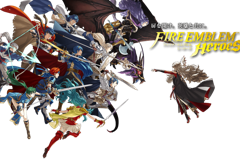
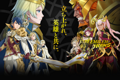
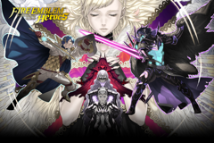
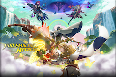

# fe7-jp-stunning-tribble
 [](https://opensource.org/licenses/mit-license.php) [](http://makeapullrequest.com)

Fire Emblem Heroes Remake on Game Boy Advance.

 

 

A hack based on Fire Emblem 7 Japanese version.

## Dependancy
* devkitpro
* cmake(>=3.13)

## Build
### Build Instruction
```
cp <game_rom> rom/fe7-jp.gba
./configure
cd build && make
```

### Build Status

|Provider|Status|
|---|---|
|[Circle CI](https://circleci.com/)|[](https://app.circleci.com/pipelines/github/laqieer/fe7-jp-stunning-tribble)|
|[Cirrus CI](https://cirrus-ci.org/)|[](https://cirrus-ci.com/github/laqieer/fe7-jp-stunning-tribble)|
|[Buddy](https://buddy.works/)|[](https://app.buddy.works/laqieer/fe7-jp-stunning-tribble/pipelines/pipeline/242079)|

## Patch
[](https://github.com/laqieer/fe7-jp-stunning-tribble/releases/latest)

## Clean ROM
Fire Emblem: Rekka no Ken \[Japan\]

md5: 9485f273f4e97e9e8f21966407f2e782

## Patcher
- [Web 1](https://www.marcrobledo.com/RomPatcher.js/)
- [Web 2](https://hack64.net/tools/patcher.php)

## Compatibility

### Emulator

|Emulator|Software Version|Compatibility|
|---|---|---|
|mGBA|0.8.3|OK|
|visualboyadvance-m|2.1.4|OK|
|Boycott Advance|0.4.2|Not OK|
|My Boy!|1.8.0|OK|
|John GBA Lite|3.91|OK|
|GBA.emu|1.5.37|OK|
|GBA.js|1.1|Not OK|

### Flashcart

|Flashcart|Kernel/Firmware|Compatibility|
|---|---|---|
|EverDrive-GBA X5|GBAOS-v1.12|OK|
|EZ-Flash Omega|k1.06_fw7|OK|

## Credit

### Battle Animation

|Class|Equipment|Credit|
|---|---|---|
|Armour Knight|Sword, Axe, HandAxe, Bow|TBA|
|Armour Knight|Magic|Orihara_Saki, TBA|
|General|Bow|TBA|
|Cavalier|Axe, HandAxe|Skitty|
|Pegasus Knight|Sword|MK404|
|Falco Knight|HandAxe|flasuban|
|Falco Knight|Staff|ShadowOfChaos|
|Wyvern Rider|Axe, HandAxe|Mikey Seregon, Alfred Kamon|
|Wyvern Rider|Bow|PrincessKilvas, Spud, Blue Druid|
|Wyvern Lord|HandAxe|TBA|
|Wyvern Lord|Bow|PrincessKilvas, Spud, Blue Druid|
|Halberdier|Lance|TBA|
|Ephraim Lord Female|Lance|Circleseverywhere|
|Thief|Dagger|GabrielKnight, Skitty|
|Thief Female|Dagger|Pikmin1211, Maiser6, Skitty, GabrielKnight|
|Phantom|Axe, HandAxe|TBA, Arch, Skitty, Temp|
|Ghost Fire|Magic|Eldritch Abomination|
|Skelemonk|Magic|JonoTheRed|

### Item Icon

|Icon|Credit|
|---|---|
|Iron Dagger, Steel Dagger, Silver Dagger|FEier|
|Poison Dagger, Smoke Dagger, Rogue Dagger|Ereshkigal|

