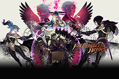

# Fire Emblem Heores Remake
 [](https://opensource.org/licenses/GPL-3.0/) [](http://makeapullrequest.com)

Remake [Fire Emblem Heroes](https://fire-emblem-heroes.com/) on [Fire Emblem 7 (J) (GBA)](https://ja.wikipedia.org/wiki/%E3%83%95%E3%82%A1%E3%82%A4%E3%82%A2%E3%83%BC%E3%82%A8%E3%83%A0%E3%83%96%E3%83%AC%E3%83%A0_%E7%83%88%E7%81%AB%E3%81%AE%E5%89%A3).

  

  

[【Click to Play】](https://laqieer.gitee.io/fehr/launcher.html#fehr) [【Wiki】](https://github.com/laqieer/FEHR/wiki) [【Discussions】](https://github.com/laqieer/FEHR/discussions) [【All Chapter Videos】](https://space.bilibili.com/343025/channel/seriesdetail?sid=917293)

[Sideline Story Remake](https://github.com/laqieer/FEHRG)

## Patch
[](https://github.com/laqieer/FEHR/releases/latest)

## Clean ROM
Fire Emblem - Rekka no Ken \[Japan\]

MD5: `9485f273f4e97e9e8f21966407f2e782`
SHA-1: `037702B1FEBD5C9535262165BF030551D153DE81`

## Patcher
- [Web 1](https://www.marcrobledo.com/RomPatcher.js/)
- [Web 2](https://hack64.net/tools/patcher.php)

## Dependancy
* [devkitpro](https://devkitpro.org)
* [cmake](https://cmake.org/)(>=3.13)
* [python3](https://www.python.org/)

## Build
### Build Instruction
```
cp <game_rom> rom/fe7-jp.gba
./configure
cd build && make
```

### Build Status

|Provider|Status|
|---|---|
|[Circle CI](https://circleci.com/)|[](https://app.circleci.com/pipelines/github/laqieer/FEHR)|
|[Cirrus CI](https://cirrus-ci.org/)|[](https://cirrus-ci.com/github/laqieer/FEHR)|
|[Buddy](https://buddy.works/)|[](https://app.buddy.works/laqieer-3/fehr/pipelines/pipeline/391264)|

## Compatibility

### Emulator

|Emulator|Software Version|Compatibility|
|---|---|---|
|mGBA|0.8.3|OK|
|visualboyadvance-m|2.1.4|OK|
|Boycott Advance|0.4.2|Not OK|
|My Boy!|1.8.0|OK|
|John GBA Lite|3.91|OK|
|GBA.emu|1.5.37|OK|
|GBA.js|1.1|Not OK|
|NanoboyAdvance|1.2|OK|

### Flashcart

|Flashcart|Kernel/Firmware|Compatibility|
|---|---|---|
|EverDrive-GBA X5|GBAOS-v1.12|OK|
|EZ-Flash Omega|k1.06_fw7|OK|

## Credit

### Battle Animation

|Class|Equipment|Credit|
|---|---|---|
|Armour Knight|Sword, Axe, HandAxe, Bow|TBA|
|Armour Knight|Magic|Orihara_Saki, TBA|
|General|Bow|TBA|
|General|Magic|DerTheVaporeon|
|Cavalier|Axe, HandAxe|Skitty|
|Pegasus Knight|Sword|MK404|
|Falco Knight|Axe, HandAxe|flasuban|
|Falco Knight|Magic|Jeorge_Reds|
|Falco Knight|Staff|ShadowOfChaos|
|Wyvern Rider|Axe, HandAxe|Mikey Seregon, Alfred Kamon|
|Wyvern Rider|Bow|PrincessKilvas, Spud, Blue Druid|
|Wyvern Lord|Axe, HandAxe|TBA|
|Wyvern Lord|Bow|PrincessKilvas, Spud, Blue Druid|
|Halberdier|Lance|TBA|
|Ephraim Lord Female|Lance|Circleseverywhere|
|Thief|Dagger|GabrielKnight, Skitty|
|Thief Female|Dagger|Pikmin1211, Maiser6, Skitty, GabrielKnight|
|Phantom|Axe, HandAxe|TBA, Arch, Skitty, Temp|
|Ghost Fire|Magic|Eldritch Abomination|
|Skelemonk|Magic|JonoTheRed|
|Anna|Axe, HandAxe|Greentea(qiuzf007)|
|Laevatein|Sword|FE7if|
|Shaman|Staff|Temp|
|Dracozombie|Dragonstone|Marlon0027, Orihara_Saki|
|Warrior Female|Axe, HandAxe, Bow|Temp|
|Witch|Magic, Staff|Aruka|

### Item Icon

|Icon|Credit|
|---|---|
|Iron Dagger, Steel Dagger, Silver Dagger|FEier|
|Poison Dagger, Smoke Dagger, Rogue Dagger|Ereshkigal|
|Fujin Yumi|Beansy|
